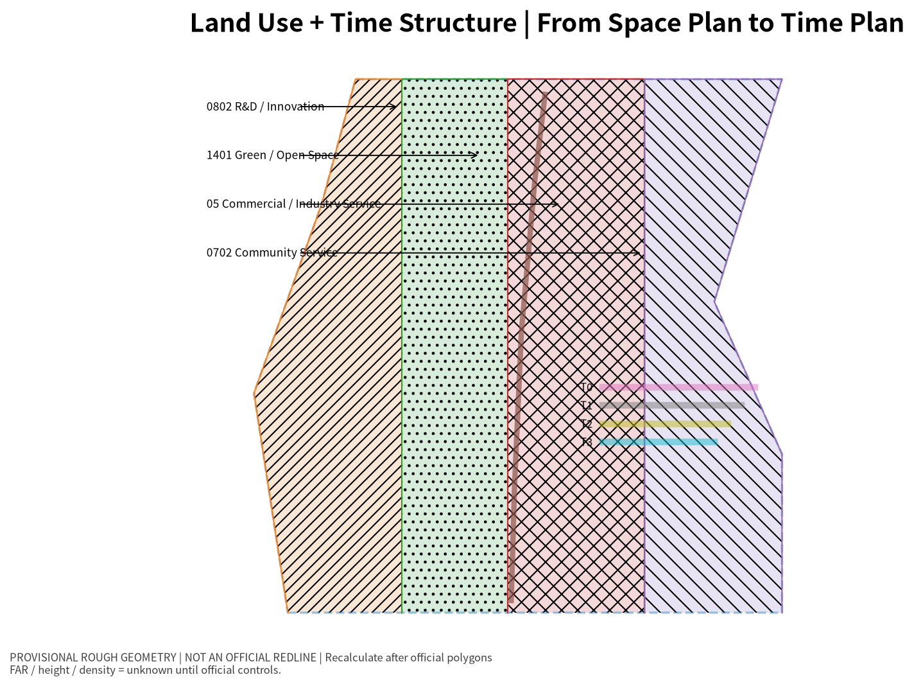
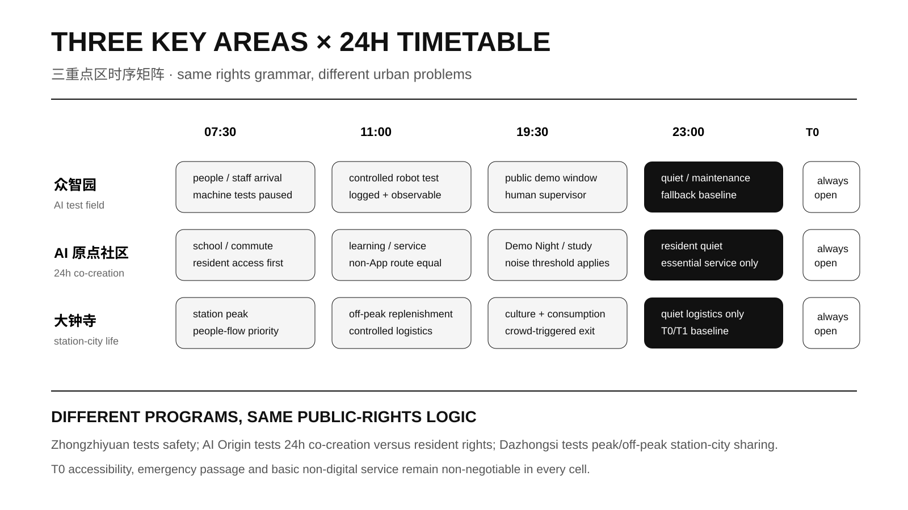
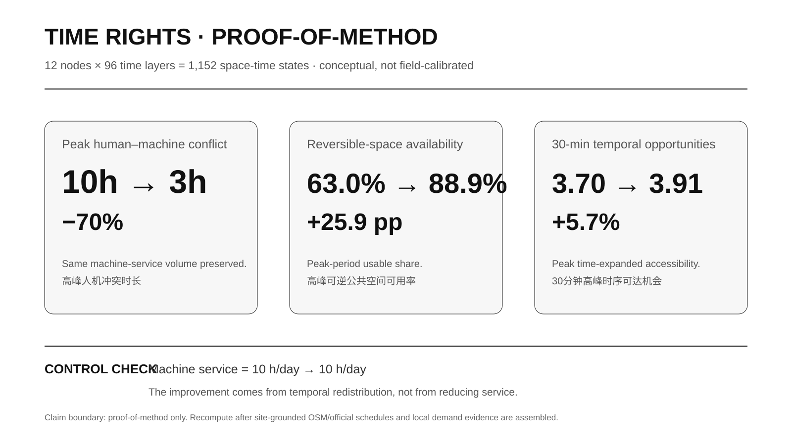
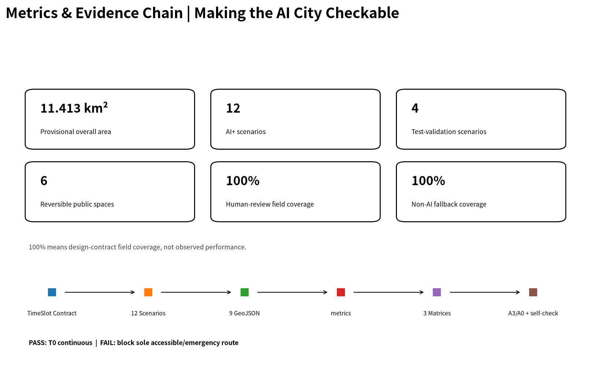

# JINGZHANG TIME RIGHTS
## From Spatial Use Rights to Temporal Use Rights｜THE CITY TIMETABLE

Conventional urban design mainly asks **what goes where**. In an AI city, the same street, square and ground-floor interface is repeatedly contested across the day by commuters, residents, students, robots, low-speed shuttles, logistics, night activities and emergency systems. **This proposal treats temporal use rights as a design variable equal to spatial use rights.**

The Jing-Zhang Railway is translated not only as heritage imagery but as an operating culture of timetable, meet/pass, priority, delay and recovery. `THE CITY TIMETABLE` remains the operating mechanism, while **TIME RIGHTS** becomes the main planning proposition: a space may change state only under pre-published rights, priorities, stop conditions and accountable human review.

This is an open-call formal submission, not government approval, statutory planning, engineering feasibility, autonomous-vehicle permission or observed field performance.

## Design Basis and Source List

The official announcement controls the project name, three-level scope, three key areas, tasks and deliverable context [source:OFFICIAL-ANNOUNCEMENT]. The Agent taskbook controls the six required tasks, scenario and persona requirements, pilgrimage landmarks and long-term operation [source:AGENT-TASKBOOK]. Urban-design, regulatory-planning and land-use boundaries follow the repository's official local reference snapshots [standard:MOHURD-URBAN-DESIGN-MEASURES] [standard:MOHURD-CONTROL-DETAILED-PLANNING] [standard:MNR-LAND-USE-CLASSIFICATION-GUIDE].

Trusted official SITE_BOUNDARY and key-area polygons, approved FAR, height, density, setback, road redlines, ownership, utilities and heritage controls are still missing. Submitted geometry therefore remains `provisional_constraint` and `official_boundary=false`; it is suitable for generation, visualization, method experiments and temporary checks only [source:BOUNDARY-SOURCE]. All precise spatial quantities must be recalculated when trusted official geometry arrives.

The quantitative extension references transport-accessibility research using time-expanded networks to represent schedule-dependent reachability [source:METHOD-TIME-EXPANDED-2026]. Only the graph idea is borrowed; empirical parameters from that paper are not transferred to Beijing.

## Three-Level Scope Framework

The official task defines approximately 43.6 km² for coordinated research, 11.4 km² for overall design, and 368.4 ha across the three key areas [source:OFFICIAL-ANNOUNCEMENT]. The 43.6 km² level studies the rhythms linking universities, enterprises, public services, logistics and global events. The 11.4 km² level becomes a City Timetable composed of constant-rights, routine-rhythm, flexible-reservation and human-confirmed-event spaces.

The three detailed areas form three distinct temporal-governance experiments rather than three copies of one AI facility package. Zhongzhiyuan tests safety and controlled experimentation; Beijing AI Origin Community tests 24-hour co-creation against everyday resident rights; Dazhongsi tests peak/off-peak sharing among rail passengers, commerce, culture and logistics [metric:key_area_count]. All three scales use the same T0–T3 rights grammar.

## Coordinated Research Area: Industry and Future City Research

Spatial planning asks **what is where**. Time Rights adds **what happens when, who has priority, what evidence allows a state change, and who must exit when conflict occurs**. The proposal retains a conceptual 9.22 km Time Spine and three time-interface lines to organize this research hypothesis [data:geometry/roads.geojson#ROAD-001] [metric:time_spine_length_m]. These lines are design devices rather than surveyed transport alignments.

Six precedents provide transferable mechanisms: NYC Open Streets demonstrates published time-window street operation; LADOT Code the Curb and the OMF Curb Data Specification demonstrate machine-readable public-right-of-way rules; Singapore LTA/CETRAN demonstrates controlled autonomous-vehicle testing; TfL School Streets demonstrates predictable time-defined priority; and Paris Rues aux écoles demonstrates youth-friendly public-space conversion [source:CASE-NYC-OPEN-STREETS-2026] [source:CASE-LADOT-CODE-THE-CURB] [source:CASE-OMF-CDS]. The remaining precedents are indexed in `sources.json`.

The research conclusion is that an AI-native city is not defined by more sensors. It is defined by rules people can understand, machines can read, accountable roles can review, and systems can safely roll back. The method chain is **Planning Question → Time Rights → TimeSlot Contract → Time-expanded Network → Spatial Prototype → Validation / Rollback**.

## Overall Design Area: Urban Renewal and Regulatory-Plan-Level Urban Design

Four time-rights layers replace the assumption that every space keeps one permanent function. **T0 Constant Rights** protects continuous accessibility, emergency access, basic walking and essential non-digital service and cannot be reserved away. **T1 Routine Rhythm** covers commute peaks, school periods, ordinary commerce, park movement and basic resident access. **T2 Flexible Reservation** covers robot delivery, low-speed shuttle testing, community classes, temporary exhibitions and youth activities. **T3 Human-confirmed Event** covers conferences, special test weeks, Demo Night and other high-crowd events that require a named accountable human.

The machine-readable TimeSlot Contract records space unit, time window, permitted actors, priority, accessibility protection, accountable human role, stop trigger, rollback action, log, non-AI fallback and validation method. Life-safety and T0 rights always outrank routine, reservation and event uses [metric:validator_negative_case_count]. AI may forecast conflicts and recommend a schedule; it cannot erase public rights or grant itself permission.

A 24-hour reversible street type turns the rule into spatial design. At 07:30 people take priority; at 11:00 controlled robot or delivery use may enter a flexible zone; at 19:30 the interface can become Demo Night; at 23:00 it returns to quiet and essential service. T0 remains continuous in all four states, so the design object is not one section but a **section + schedule + rights contract**.

## Detailed Design of Key Areas

**Zhongzhiyuan — AI Temporal Testing Ground.** Morning peaks are people-first. Daytime opens controlled windows for robot delivery and low-speed shuttle tests. Evening can become a public observation and Demo period. Night returns to maintenance while T0 essential access remains continuous. The area tests degradation, crowd-peak automatic exit, human takeover and log replay [metric:test_validation_scenario_count].

**Beijing AI Origin Community — 24h Co-creation Timetable Community.** Morning supports school, work and public services; daytime supports learning and co-creation; evening supports Demo Night, light sport and youth third places; night protects residential quiet and essential service. Basic services retain physical signage, paper information or human assistance as non-AI equivalents [metric:non_ai_fallback_coverage].

**Dazhongsi — AI-native Everyday-life Timetable.** Peak periods prioritize people and transfer movement; daytime supports commerce and ordinary life; evening supports youth culture and consumption; night moves replenishment and logistics off-peak. Machine activity exits under high-crowd conditions. Because the current key-area geometry is provisional, no precise station-quadrant or engineering placement is claimed.

The three pilgrimage nodes remain **TIMETABLE HALL, TIME EXCHANGE and CENTENNIAL DEPARTURE** [data:geometry/public_space.geojson#PUBLIC-001]. They act as public rule interfaces showing current state, next state, T0 rights, accountable human role and rollback status.

## AI Innovation Ecosystem, Personas, and AI+ Scenarios

The machine-readable scenario set contains six personas and 12 complete AI+ scenarios [metric:scenario_count]. They cover robot-delivery time-window stress tests, low-speed shuttle conflict degradation, crowd-peak automatic exit, human takeover and replay, Demo Night reversible public rooms, no-app public-service navigation, AI cultural guidance with an equivalent non-digital route, night learning and light sport, scene-open booking, enterprise demo slots, event-day multi-actor scheduling, and a public Time Rights display.

The six user groups are AI startup/developer teams, university students and young researchers, nearby residents, accessibility and older users, merchants and night workers, and logistics/maintenance/emergency roles. The proposal therefore treats the AI ecosystem as a relationship among innovation, everyday life, inclusion and accountable operation rather than as a collection of technology showcases.

All 12 scenarios contain human-review and non-AI fallback fields. `human_override_coverage` and `non_ai_fallback_coverage` are therefore 100% at the **design-contract level**, not as measured operational performance [metric:human_override_coverage] [metric:non_ai_fallback_coverage].

## Land Use, Building Scale, and Retain-Renovate-Demolish Strategy

`geometry/land_use.geojson` uses machine-checkable `land_use_code` values for a conceptual functional structure without claiming regulatory approval [data:geometry/land_use.geojson#LU-001] [standard:MNR-LAND-USE-CLASSIFICATION-GUIDE]. FAR, approved height, density and setback remain unknown [metric:floor_area_ratio]. This prevents the submission from inventing statutory controls that are not present in the public package.

Six `candidate_retrofit` units express adaptable existing-stock types and reversible ground-floor interfaces only; they are not surveyed existing buildings. Their conceptual footprint totals approximately 88,629 m² [metric:building_footprint_area_sqm]. They are used to test how receiving, pickup, shared meeting, night learning and other dynamic functions can be absorbed by adaptable ground floors instead of permanently occupying the curb or walking zone.

The retain/retrofit strategy therefore prioritizes reversible interfaces and existing-stock adaptation before demolition or new construction. It is a design direction to be tested against ownership, heritage, structural and regulatory evidence later, not a confirmed demolition or construction schedule.

## Transport, Rail, Municipal Infrastructure, and Public Services

`ROAD_CENTERLINE` features represent a conceptual Time Spine and three interfaces, not existing road centerlines or engineering alignments [data:geometry/roads.geojson#ROAD-001]. T0 constraints are proposal-internal rights lines rather than statutory road or fire redlines. The conceptual T0 network totals about 12.33 km and protects accessibility, emergency access and basic walking under every operating state [metric:t0_constant_rights_corridor_length_m].

Digital infrastructure is defined as more than sensors: it includes public operating status, machine-readable rules, human takeover, anomaly logs, rollback records and non-digital backup. Energy, compute, sensing, communications, utilities and fire capacity remain pending professional evidence. Basic public service must continue to work for a person without a mandatory app, facial recognition or persistent individual tracking.

To prevent “temporal planning” from remaining only a narrative, the proposal builds a **12-node × 96 fifteen-minute time-expanded network**, creating 1,152 space-time states [metric:temporal_model_node_count] [metric:temporal_model_state_count]. Nodes derive from six conceptual retrofit units and six timetable public spaces; walking links, demand weights and machine windows are explicit design assumptions rather than observed site data.

An uncoordinated baseline is compared with a Time Rights schedule while holding total machine-service time at 10 hours per day. Peak human-machine conflict falls from 10h to 3h (**-70%**); peak flexible-space public availability rises from 63.0% to 88.9% (**+25.9 percentage points**); and mean 30-minute peak temporal reachability rises from 3.70 to 3.91 opportunities (**+5.7%**) [metric:peak_conflict_reduction_ratio] [metric:peak_flexible_space_availability_gain_pp] [metric:temporal_reachability_gain_ratio]. Machine service remains 10h/day [metric:machine_service_hours_preserved].

These values demonstrate internal behavior under stated assumptions only. They are not real-site performance and must be recalculated with observed pedestrian flows, robot demand, event schedules, street widths, OD data and official polygons.

## Blue-Green Network, Public Space, and Urban Character

The visual language avoids generic “future-tech blue light.” Railway time axes, station points, meet/pass lines and recovery logic are translated into signage, paving, public information and event systems [standard:MOHURD-URBAN-DESIGN-MEASURES]. This keeps the Jing-Zhang heritage narrative active as an operating culture instead of reducing it to decorative railway motifs.

The conceptual green layer combines a heritage-park timetable green corridor and flexible open-space bands in the three key areas. Based on the provisional boundary and EPSG:4548, `green_ratio=31.5058%`; this is a conceptual layer ratio, not an approved statutory green ratio [metric:green_ratio]. Six reversible public spaces include three pilgrimage nodes and three test/youth/everyday-life spaces, with a conceptual ratio of about 1.4959% [metric:public_space_ratio] [metric:reversible_public_space_count].

The cultural narrative is therefore a dual system of **spatial rights + temporal rights**. Railway history provides the prototype of shared time; Zhongguancun provides open innovation and knowledge exchange; AI culture adds transparent rules, accountable boundaries and reversible human-machine collaboration.

## Renewal Projects, Implementation Policy, and Phasing

**Near term:** establish the TimeSlot Contract, public Time Rights display, T0 accessibility/emergency checks, no-app navigation, a Demo Night reversible public room, the 24h street-type pilot, and controlled robot tests that do not imply ordinary public-road permission. These projects are small enough to verify the governance mechanism before large capital commitments.

**Mid term:** after official polygons and professional constraints arrive, replace proof-of-method assumptions with observed pedestrian flows, verified activity schedules and logistics demand. Recalculate temporal accessibility, conflict, space availability and key-area placement on the real mapped network. This is the point where the research model becomes empirically calibratable rather than merely internally consistent.

**Long term:** only after traffic, safety, planning, utilities, heritage, ownership and operational approvals become clear should higher-level embodied-AI public operation or physical reconstruction be considered. Annual programs include Open Timetable Week, Urban Agent Scheduling Challenge, Robotics Low-speed Test Week, Jing-Zhang Demo Night and an Annual Time Rights Review.

## Metrics, Area Recalculation, and Compliance Matrix

Current metrics are deliberately split between spatial quantities derived from provisional geometry, design-contract coverage metrics, and scenario-based temporal proof metrics. They must not be mixed into one claim of “project performance.” The main site area is currently 11,412,825.386 m² from the provisional polygon; conceptual retrofit footprint is 88,628.915 m²; the conceptual green-layer ratio is 31.5058%; the conceptual six-space public-space ratio is 1.4959%; and the Time Spine is approximately 9,216.69 m [metric:site_area_sqm] [metric:building_footprint_area_sqm] [metric:green_ratio].

The temporal proof records 12 nodes, 1,152 space-time states, -70% peak conflict in the stated scenario, +25.9 percentage points of peak flexible-space availability, +5.7% mean 30-minute peak reachability, and 10h/day machine service preserved between baseline and Time Rights scheduling [metric:temporal_model_state_count] [metric:peak_conflict_reduction_ratio] [metric:temporal_reachability_gain_ratio].

FAR remains `unknown` because approved controls and official geometry are absent [metric:floor_area_ratio]. Requirement, standard, design-depth, geometry, metric and risk traceability remain in `compliance_matrix.json`, `standard_matrix.json`, `design_depth_matrix.json`, `metrics.json` and `assumptions.json`.

## Risk, Copyright, and Compliance

Official polygons are missing, so all provisional-derived areas, ratios and placements must be recalculated. FAR, height, density, setback, road redlines, utilities, heritage controls and ownership are not invented. Robotics testing is not public deployment permission. Dazhongsi remains provisional and is not represented as an exact station-city engineering plan. The time-expanded network uses conceptual nodes, assumed demand weights and assumed operating windows; its -70%, +25.9pp and +5.7% outputs must never be reported as observed field outcomes.

Essential public services do not depend on facial recognition, persistent individual tracking, a mandatory app or one vendor. T0 accessibility, emergency passage and basic non-digital service remain non-negotiable across all operating states. Every flexible or event state includes a human responsibility path, stop condition and rollback logic.

Core figures, temporal-network figures and drawings are generated from this proposal's structured design data and original diagramming. No competitor submission, corporate logo or unauthorized image is copied. The work is described only as an open-call formal submission until organizer review or later implementation decisions occur.

## References

Primary project evidence consists of the official Centennial Jing-Zhang AI Innovation Belt urban-design open-call announcement [source:OFFICIAL-ANNOUNCEMENT], the Agent open-call taskbook [source:AGENT-TASKBOOK], the repository source registry [source:SOURCE-REGISTRY], and the local official-reference snapshots for urban design, regulatory planning and land-use classification [standard:MOHURD-URBAN-DESIGN-MEASURES] [standard:MOHURD-CONTROL-DETAILED-PLANNING] [standard:MNR-LAND-USE-CLASSIFICATION-GUIDE].

Mechanism precedents are NYC DOT Open Streets, LADOT Code the Curb, Open Mobility Foundation CDS, Singapore LTA autonomous-vehicle testing, TfL School Streets and Paris Rues aux écoles, all indexed in `sources.json`. The time-expanded network is informed methodologically by Udhayasekar, Srinivasan & Chilukuri (2026), *Revisiting transit accessibility: effect of stochasticity, real-time information, congestion, and network structure* [source:METHOD-TIME-EXPANDED-2026]. No empirical parameter or performance result is transferred from those precedents into the Jing-Zhang site.
