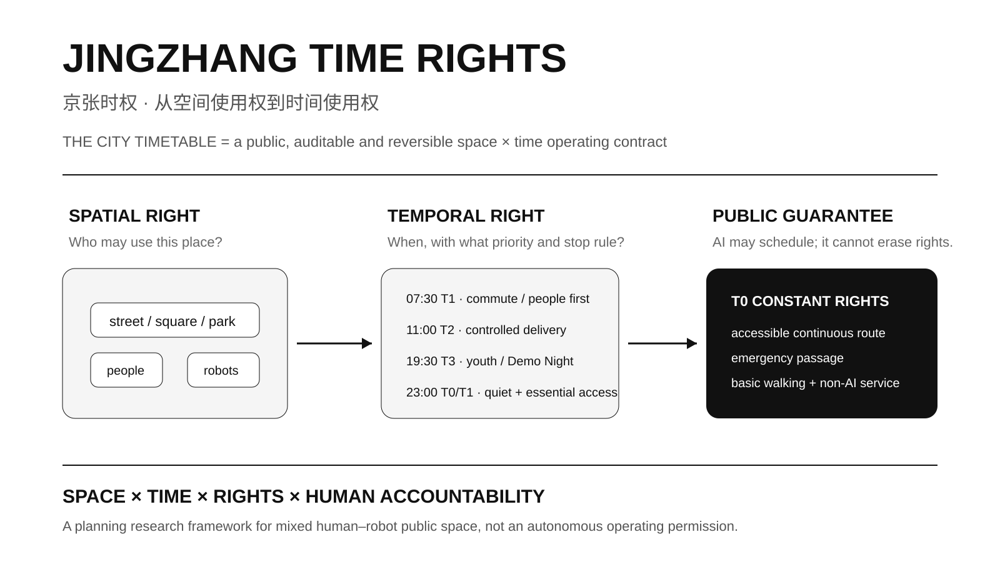
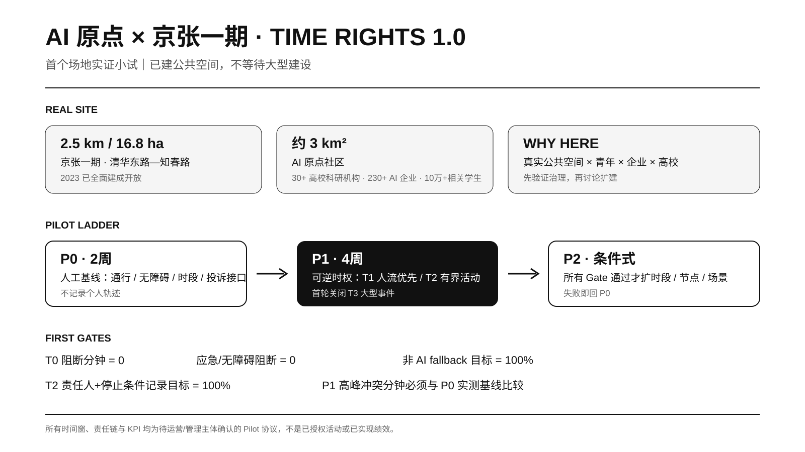
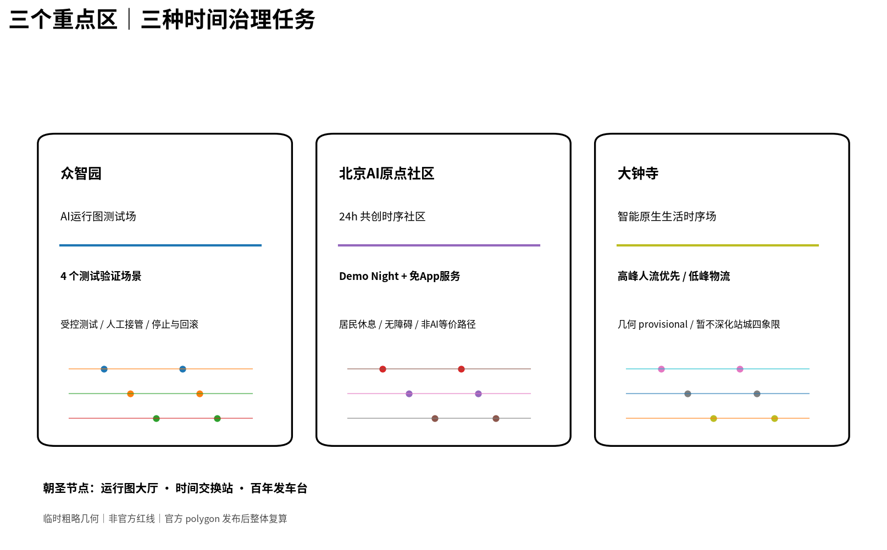
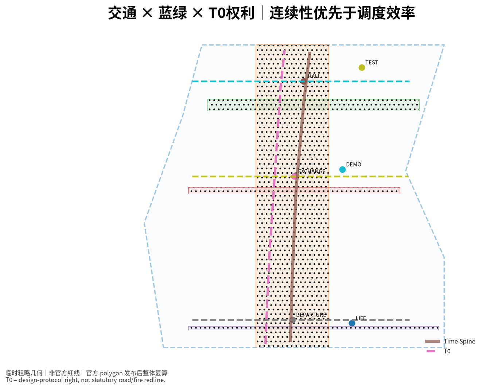

# 京张时权 · THE CITY TIMETABLE
## 从空间使用权到时间使用权｜JINGZHANG TIME RIGHTS

传统城市设计主要回答“什么功能放在哪里”。AI 城市还必须回答：**同一空间在什么时候由谁优先使用，冲突时谁退出，失效后如何恢复。** 本方案因此把“时间使用权”提升为与空间使用权并列的规划变量。京张铁路的“时刻、会让、优先、延误、恢复”成为机制原型；`THE CITY TIMETABLE` 是运行系统，**京张时权**是规划主张。

本成果为 open-call formal submission，不代表政府批准、法定规划、工程可行性、自动驾驶许可或现场实测绩效。

## 设计依据与资料清单

项目范围、三处重点区域和设计任务以官方征集公告为主控依据 [source:OFFICIAL-ANNOUNCEMENT]；六项 Agent 任务、场景卡、画像、地标和长期运营要求来自任务书 [source:AGENT-TASKBOOK]。城市设计、控规边界意识与用地分类参照仓库登记的官方标准 [standard:MOHURD-URBAN-DESIGN-MEASURES] [standard:MOHURD-CONTROL-DETAILED-PLANNING] [standard:MNR-LAND-USE-CLASSIFICATION-GUIDE]。

官方精确 SITE_BOUNDARY、三处重点区 polygon，以及 FAR、高度、密度、退线、道路红线、权属、市政和文保等控制仍未完整取得，因此竞赛几何继续标记为 `provisional_constraint`、`official_boundary=false` [source:BOUNDARY-SOURCE] [assumption:A-BOUNDARY-001]。

但本轮增加了可支撑“为什么在这里先试”的**真实场地证据**：京张铁路遗址公园一期已建成开放，清华东路至知春路约 2.5 km、16.8 ha [source:JZ-PARK-PHASE1-OFFICIAL]；2026 年二期配套项目完工，北段约 30.01 ha，并形成骑行、慢跑、步行串联的鱼骨状慢行网络 [source:JZ-PARK-PHASE2-2026]。北京 AI 原点社区约 3 km²，公开信息显示汇聚 30 余所高校及科研机构、230 余家 AI 企业和约 10 万 AI 相关专业学子 [source:AI-ORIGIN-2026-BJFGW]。京张沿线人工智能创新街区街区控规草案亦已完成公开公示与意见采信环节 [source:JZ-CONTROL-PLAN-PUBLIC-2025]。

这些公开事实只用于确定现实研究背景和 Pilot 选择，**不替代竞赛 official polygon，也不推导未公开的法定指标。** 时间扩展网络仅借鉴时变可达性的方法结构，不搬用外地论文参数 [source:METHOD-TIME-EXPANDED-2026]。

## 三层范围工作框架

官方任务形成约 43.6 km² 统筹研究范围、约 11.4 km² 总体设计范围和三处重点区域合计约 368.4 ha [source:OFFICIAL-ANNOUNCEMENT]。

- **43.6 km²：创新协同运行域。** 研究高校、企业、公共服务、物流和活动在时间尺度上的关系。
- **11.4 km²：City Timetable 主系统。** 建立恒定权利、日常节律、弹性预约和人工确认事件空间。
- **三重点区：三类时间治理实验。** 众智园验证测试安全；AI 原点验证青年共创与居民日常权利；大钟寺验证轨道客流、商业、夜间活动与物流错峰 [metric:key_area_count]。

三层都使用 T0–T3 权利语法，上层研究节律，中层组织共享，重点区把规则变成可检查、可拒绝、可回滚的空间原型。

## 统筹研究范围产业与未来城市研究

京张时权增加四个传统空间规划较少直接表达的问题：**什么时候发生、谁优先、什么证据允许切换、谁在冲突时退出。** 总体形成约 9.22 km 的概念时间主脊和三个重点区时序接口 [data:geometry/roads.geojson#ROAD-001] [metric:time_spine_length_m]。

六个案例只提取机制：NYC Open Streets 的时段开放、LADOT Code the Curb 与 OMF CDS 的机器可读路权、Singapore LTA/CETRAN 的受控自动驾驶测试、TfL School Streets 的固定优先时段、Paris Rues aux écoles 的青年友好公共空间 [source:CASE-NYC-OPEN-STREETS-2026] [source:CASE-LADOT-CODE-THE-CURB] [source:CASE-OMF-CDS]。结论不是“部署更多传感器”，而是让规则**人能理解、机器能读、责任人能复核、失败能回滚**。

方法链为：**Planning Question → Time Rights → TimeSlot Contract → Time-expanded Network → Spatial Prototype → Validation / Rollback**。本案以 12 节点 × 96 个 15 分钟时片构造 proof-of-method；所有需求权重和运行窗均是设计假设 [assumption:A-TEMPORAL-MODEL-001]。

## 总体设计范围城市更新与控规深度城市设计

四级时权构成同一套空间运行语法 [data:visual/assets/timeslot_contract.json]：

- **T0 恒定权利**：无障碍、应急、基础步行和必要非数字服务，不可被预约覆盖。
- **T1 日常节律**：通勤、学校、居民出入、日常商业和公园慢行。
- **T2 弹性预约**：机器人配送、低速测试、社区课程、展陈和青年活动。
- **T3 人工确认事件**：大会、特殊测试周、Demo Night 等高客流事件，必须有具名责任角色。

TimeSlot Contract 至少记录空间单元、时间窗、允许主体、优先级、无障碍保护、责任人、停止条件、回滚、日志、非 AI fallback 和验证方法。堵塞唯一无障碍/应急通道直接拒绝 [metric:validator_negative_case_count]。

24h 可逆街道类型把规则落成“**剖面 + 时刻表 + 权利合同**”：07:30 人流优先，11:00 可进入受控 T2，19:30 可转青年活动，23:00 回到安静和必要服务；T0 始终连续。该剖面是类型表达，不代表已测道路宽度或法定红线 [assumption:A-CONTROLS-001]。

## 重点区域详细设计

三处重点区承担不同实验，不复制同一套“AI 设施” [depth:three_key_area_detailed_design]。

### 众智园：AI 时序测试场

早高峰人流优先，日间安排受控机器人配送/低速接驳测试，晚间可进入公众观察与 Demo，夜间维护并保留 T0。重点验证冲突降级、自动退出、人工接管与日志回放 [metric:test_validation_scenario_count]。

### 北京 AI 原点社区：24h 共创时序社区

现实基础使这里最适合作为第一处落地验证：约 3 km² 的近校创新街区与已建成京张一期公共空间相邻 [source:AI-ORIGIN-2026-BJFGW] [source:JZ-PARK-PHASE1-OFFICIAL]。

#### 首个可执行小试：AI 原点 × 京张一期「TIME RIGHTS 1.0」

首轮不等待新建道路、拆迁或大型资本工程，而以清华东路—知春路 2.5 km / 16.8 ha 已建公共空间为现实底板。Pilot 只验证一件事：**在不牺牲 T0 的前提下，青年活动、公共服务、展示和有边界技术测试能否通过公开、可拒绝、可回滚的时间合同共存。** 机器可读协议见 `research/ai-origin-time-rights-pilot.json` [assumption:A-PILOT-001]。

- **P0｜2 周基线**：人工巡查主要出入口、无障碍连续性、早晚高峰、活动/安静节点、投诉管理接口和非数字服务入口；只记录聚合计数，不建立个人轨迹。
- **P1｜4 周可逆小试**：建议 07:30–09:30 人流优先；11:00–15:00 为待确认的有边界 T2 展示/受控测试；18:30–21:00 青年与社区活动；21:00 后回到安静和必要服务。首轮关闭 T3 大型事件。
- **P2｜条件式扩展**：只有 T0 连续性、人工接管、投诉响应、非 AI fallback 与日志完整度全部达标，才扩大时段、节点或场景，否则回到 P0。

责任链建议为“公园运营/管理方—属地街道与社区—AI 原点运营主体—高校/志愿者—测试企业—无障碍与居民代表—独立复核者”，**不表示任何单位已承诺参加**。出现唯一无障碍/应急路径被占、责任人缺席、隐私越界或非 AI 等价路径失效时，立即冻结该时段。

首轮 Gate 不是机器人吞吐量，而是公共权利：`T0_blocked_minutes=0`、应急/无障碍阻断事件=0、非 AI fallback 目标 100%、T2 责任人与停止条件记录目标 100%，并用 P0 实测基线比较 P1 高峰冲突分钟。以上均为**待验证目标，不是已实现绩效**。

### 大钟寺：智能原生生活时序场

高峰坚持人流/换乘优先，日间商业与生活，晚间青年文化，夜间错峰补货。2026 年公开的“南部大钟寺 AI 产业集聚区更新片区”已提出实施单元统筹、近中远期更新、公益性/经营性空间统筹和城市设计引导，说明这里存在现实更新实施框架 [source:DAZHONGSI-URBAN-RENEWAL-2026]。但该公开项目边界**不自动等于竞赛 provisional key-area polygon**，因此仍不伪造站城四象限或工程落位 [assumption:A-DAZHONGSI-001]。

三处 AI 朝圣节点为 **TIMETABLE HALL / 运行图大厅、TIME EXCHANGE / 时间交换站、CENTENNIAL DEPARTURE / 百年发车台** [data:geometry/public_space.geojson#PUBLIC-001]，其共同作用是把当前状态、下一状态、T0 权利、责任人与异常回滚公开显示。

## AI 创新生态、人才画像与 AI+ 场景

品牌系统统一使用 **京张时权 · THE CITY TIMETABLE**；视觉语法来自铁路时刻轴、站点、会让线和恢复线，而不是通用“科技蓝光”。六类用户画像覆盖 AI 创业/开发者、高校学生与青年研究者、周边居民、无障碍与高龄使用者、商户与夜间服务者、物流/运维/应急角色 [metric:scenario_count]。

12 个场景包括：机器人配送时间窗、低速接驳冲突降级、人群高峰自动退出、人工接管与日志回放、Demo Night 可逆客厅、免 App 公共服务导航、AI 文化导览 + 非数字路线、夜间学习与轻运动、场景预约准入、企业 Demo 时段共享、活动日多主体排程、公共时权表。至少四项属于测试验证场景 [metric:test_validation_scenario_count]。

所有场景都要求人工复核和非 AI fallback，设计合同层覆盖率为 100%，但不等于真实运营绩效 [metric:human_override_coverage] [metric:non_ai_fallback_coverage] [assumption:A-METRICS-001]。长期运营包括 Open Timetable Week、Urban Agent Scheduling Challenge、Robotics Low-speed Test Week、Jing-Zhang Demo Night 与 Annual Time Rights Review，用持续复核而非一次性科技展维持品牌资产。

## 用地、建筑规模与拆改留方案

`geometry/land_use.geojson` 仅表达可校验的概念功能结构，不构成控规批准 [data:geometry/land_use.geojson#LU-001] [standard:MNR-LAND-USE-CLASSIFICATION-GUIDE]。FAR、正式高度、密度和退线保持 unknown [metric:floor_area_ratio]。

建筑层 6 个 `candidate_retrofit` 单元只用于表达“优先存量适应性改造、可逆首层与公共界面”，概念基底约 88,629 m² [metric:building_footprint_area_sqm]。首层收发、候取、共享会议和夜间学习等功能优先进入可逆建筑界面，减少长期占用路缘与步行空间；不据此推断拆迁量或确定性新建规模 [assumption:A-CONTROLS-001]。

## 交通、轨道、市政与公共服务设施

概念 Time Spine 和三个时序接口不是现状道路中心线或工程定线 [data:geometry/roads.geojson#ROAD-001]。T0 概念连续线约 12.33 km，用来表达无障碍、应急和基础步行在任何排程状态下保持连续 [metric:t0_constant_rights_corridor_length_m]。

数字基础设施不仅是传感器，还包括公开运行状态、机器可读规则、人工接管、异常日志、回滚记录和非数字备份。能源、算力、通信、市政与消防容量仍待专业资料 [assumption:A-CONTROLS-001]。

时间扩展 proof 在保持机器服务总时长 10h/日不变的设定下，将高峰人机冲突从 10h 降至 3h（-70%），高峰可逆空间可用率由 63.0% 提至 88.9%（+25.9pp），30 分钟高峰时序可达由 3.70 提至 3.91（+5.7%）[metric:peak_conflict_reduction_ratio] [metric:peak_flexible_space_availability_gain_pp] [metric:temporal_reachability_gain_ratio]。这些只证明模型在给定假设下的内部行为，不能写成现场效果 [assumption:A-TEMPORAL-MODEL-001]。

## 蓝绿空间、公共空间与城市风貌

概念绿地层按 provisional boundary 复算 `green_ratio=31.5058%`，不是批准绿地率 [metric:green_ratio]。六处可逆公共空间的概念比例约 1.4959% [metric:public_space_ratio]。设计重点不是追求一个比例，而是让空间在不牺牲 T0 的前提下拥有多个时间模式。

文化叙事是“**空间权利 + 时间权利**”：京张铁路提供共享时间的历史原型，中关村提供开放创新，AI 新文化提供透明规则、责任边界和人机协作。风貌以时间轴、站点、会让和恢复逻辑进入导视、铺装、公共信息与活动系统 [standard:MOHURD-URBAN-DESIGN-MEASURES]。

## 更新项目清单、实施政策与分期计划

近期首先实施 **AI 原点 × 京张一期 TIME RIGHTS 1.0** 的 P0 两周基线 + P1 四周可逆小试，同步完成 TimeSlot Contract、公开时权表、T0 无障碍/应急校核和免 App 导航 [assumption:A-PILOT-001]。首轮用已建公共空间验证治理，不先投入大型建设。

中期在 official polygon、道路、客流、活动和物流数据补齐后，以现场基线替换 proof-of-method 假设，重新计算时序可达、冲突与空间可用率。远期只有在交通、安全、规划、市政、文保、权属与运营许可明确后，才讨论更高等级具身智能公共运行 [assumption:A-ROBOTICS-001]。

## 指标体系、面积复算与合规矩阵

结构化指标、空间图层和时间模型分别保存“空间量、设计合同覆盖、情景 proof”，不能混成项目绩效 [metric:site_area_sqm]。

| 指标 | 当前值 | 边界 |
| --- | ---: | --- |
| `site_area_sqm` | 11,412,825.386 m² | provisional boundary |
| `building_footprint_area_sqm` | 88,628.915 m² | 6 个概念 retrofit 单元 |
| `green_ratio` | 31.5058% | 概念绿地层比例 |
| `public_space_ratio` | 1.4959% | 六处时序公共空间 |
| `time_spine_length_m` | 9,216.69 m | 概念主脊 |
| `scenario_count` | 12 | 场景卡 |
| `human_override_coverage` | 100% | 设计字段覆盖率 |
| `non_ai_fallback_coverage` | 100% | 设计字段覆盖率 |
| `peak_conflict_reduction_ratio` | 70% | 情景 proof，非实测 |
| `floor_area_ratio` | unknown | 待正式控规与边界 |

任务、标准、设计深度、指标与风险追踪见 `compliance_matrix.json`、`standard_matrix.json`、`design_depth_matrix.json`、`metrics.json` 和 `assumptions.json` [depth:metrics_recalculation]。

## 风险、版权与合规说明

1. official polygons 缺失，provisional-derived 面积和落位须整体复算 [assumption:A-BOUNDARY-001]。
2. FAR、高度、道路、市政、文保、权属等不自行推定 [assumption:A-CONTROLS-001]。
3. AI 原点 Pilot 尚未授权、尚未运行；时间窗、责任链和 Gate 都是待确认协议 [assumption:A-PILOT-001]。
4. 机器人测试不等于公共部署许可 [assumption:A-ROBOTICS-001]。
5. -70%、+25.9pp、+5.7% 是情景模型结果，不得作为现场绩效 [assumption:A-TEMPORAL-MODEL-001]。
6. 基本公共服务不依赖人脸识别、持续个人追踪、强制 App 或单一供应商。
7. 核心图和模型为本方案原创/程序化生成，不复制其他投稿、企业 Logo 或未经授权图像；版权说明见 `report/copyright_statement.md`。

## 参考资料

- 百年京张 AI 创新带城市设计国际方案征集资格预审公告 [source:OFFICIAL-ANNOUNCEMENT]
- 面向全球智能体开展百年京张 AI 创新带城市设计开源征集任务书 [source:AGENT-TASKBOOK]
- 京张铁路遗址公园一期建成开放、二期配套完工 [source:JZ-PARK-PHASE1-OFFICIAL] [source:JZ-PARK-PHASE2-2026]
- 北京 AI 原点社区现实运行基础 [source:AI-ORIGIN-2026-BJFGW]
- 京张沿线人工智能创新街区控规公示采信、大钟寺更新片区公开项目 [source:JZ-CONTROL-PLAN-PUBLIC-2025] [source:DAZHONGSI-URBAN-RENEWAL-2026]
- NYC/LADOT/OMF/Singapore/TfL/Paris 机制案例及 time-expanded network 方法，详见 `sources.json` [source:METHOD-TIME-EXPANDED-2026]
